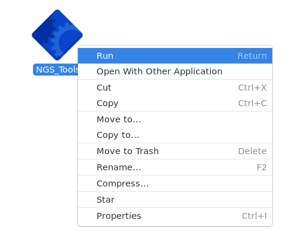
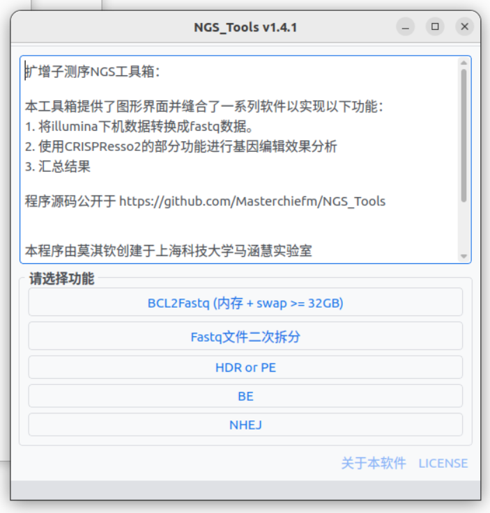
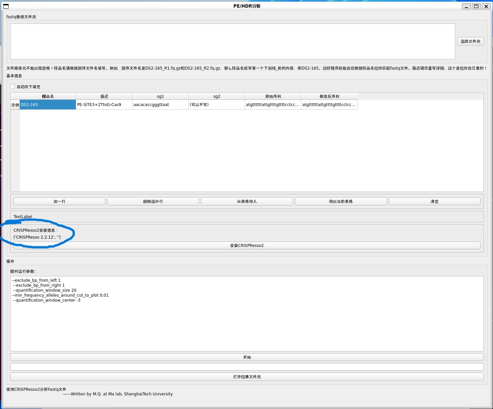

# NGS Toolbox
## Purpose
Provide a graphical interface, so that people who don't know the command line can also use bioinformatics tools to easily analyze gene editing effects.

## Cite this work


If this work helps, please cite my work.

It is recommended that citing the script by a link (such as: NGS_Tools(https://doi.org/10.5281/zenodo.8243045)) or refer to this page [Ways to cite a GitHub Repo](https://www.wikihow.com/Cite-a-GitHub-Repository)to promote reproducibility of your work.

## How to use
### Preperation
You need a Linux system with a graphic user interface(GUI). The Ubuntu 22.04 was tested and recommeded. For the hardware, a 12 core CPU or higher is recommeded. If the core is under 12, it will be a long time to annalyse.

After install the linux system, a conda enviroment is required. This script set ~/miniconda3 as conda directory, so please install miniconda 3 and keep all defaults, especially the installation path. For mininconda installation, please check [here](https://docs.conda.io/projects/miniconda/en/latest/)

## Run and Ccompile
### Install requirements
Clone this Repo and cd into it. Then run the code as follow:

A python10 env is tested, higher version works, too. Before you run the code, install python3.10 and other requirements.
```
pip install -r requirements.txt
```
### Enjoy
Now you can run and debug:
```
python3 NGS_Tools.py
```

OR, you can compile it.

you can compile any module to a binary file.

```
pyinstaller module_you_want_to_compile.py
```

for example, 
```
pyinstaller BE.py
```


## Notice
1. This document is translated with New Bing AI. You may refer to the [Original doc in Chinese](https://github.com/Hanhui-Ma-Lab/NGS_Tools/blob/master/README_ZH.md) .
2. This is the pubish version, for later update, you may refer to [here](https://github.com/Masterchiefm/NGS_Tools)
3. I hope you can appriciate my work and my contribution.My work may helped someone.
   
## Video Tutorial
[Bilibili-Use amplicon sequencing to analyze gene editing efficiency by yourself without any knowledge of Linux](https://www.bilibili.com/video/BV1q84y1w7HH/)

Remember to tip after watching

## Features
1. Provide a graphical interface for bcl2fastq, which can split the data from the machine (demultiplex).
For detailed instructions, please refer to [illumina document](https://support.illumina.com/sequencing/sequencing_software/bcl2fastq-conversion-software.html)
2. Provide a graphical interface for [CRISPResso2](https://github.com/pinellolab/CRISPResso2), which can batch analyze HDR, PE, BE, NHEJ.
3. Collect editing data and summarize it into an excel table.
4. One-click installation of analysis environment


## Running on Windows
This program can only run on Linux systems. If you use Windows, you can also use it in the Linux subsystem of Windows, but you need to configure it slightly.Or download Virtual Box, install Ubuntu Desktop version or other desktop distribution in the virtual machine to run this program. We recomend to use WSL2, which is of better performance than virtual machine and we provide a tutor below.

If you use Linux Subsystem for Windows (WSL), please refer to [this guide](Windows_HELP/HELP_WIN.md) for configuration. After completing the configuration, **continue to view the relevant content of running on Linux system**.


## Running on Linux system
System requirements:
1. You must install a Chinese system, English system may have character garbled. If you encounter character garbled, please add Chinese fonts to the system yourself
2. You can use any of the following distributions
```
Ubuntu Desktop
Cent OS
UOS (Unified Operating System)
Deepin OS (Deepin Operating System)
```

Other requirements:
1. bcl2fastq requires memory + swap partition at least 32GB, recommend using 32GB or more memory CPU recommended 8 cores or more


## Run from binary file

1. Check allow as executable program in permissions and close the window


----
2. Right-click on the program and click run, or double-click to run



----
3. Choose the function you need


---

4. Be sure to install the analysis environment for the first time

If not installed, there will be a prompt here, if installed, it will be displayed as shown in the figure,
The installation process will freeze for a long time, there is no output in the foreground, please be patient




# Parameter Settings
Please pay attention to these two parameters: quality control and analysis window! These two parameters have a significant impact on the results. [Click here to read](https://gitee.com/MasterChiefm/NGS_Tools/blob/master/help/parameters.md)
