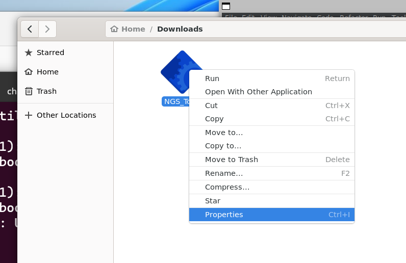
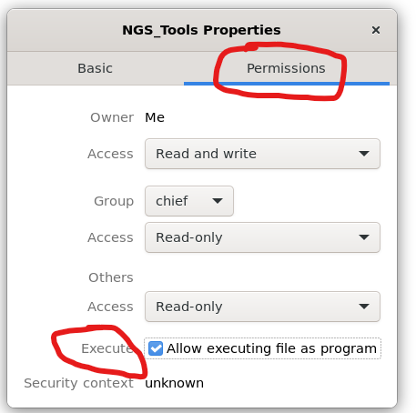
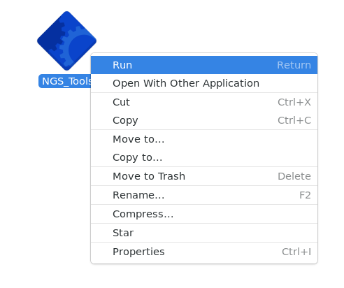
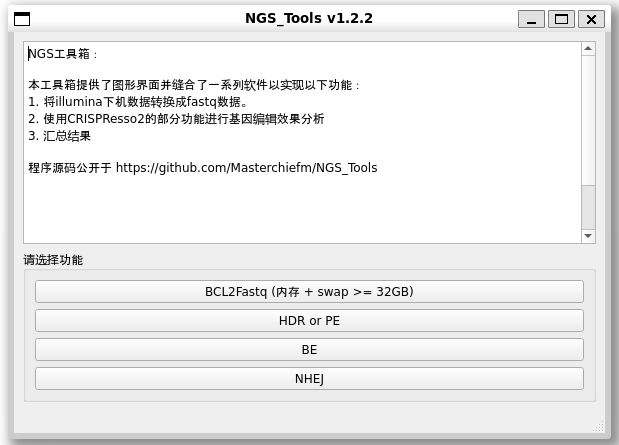
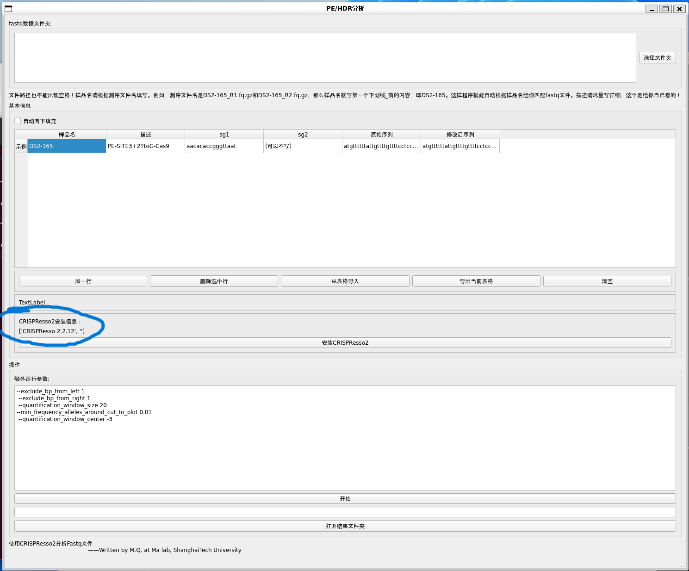

# NGS Toolbox
## Purpose
Provide a graphical interface, so that people who don't know the command line can also use bioinformatics tools to easily analyze gene editing effects.

## Video Tutorial
[Bilibili-You can also use amplicon sequencing to analyze gene editing efficiency by yourself without Linux](https://www.bilibili.com/video/BV1q84y1w7HH/)

Remember to tip after watching

## Features
1. Provide a graphical interface for bcl2fastq, which can split the data from the machine (demultiplex).
For detailed instructions, please refer to [illumina explanation](https://support.illumina.com/sequencing/sequencing_software/bcl2fastq-conversion-software.html)
2. Provide a graphical interface for [CRISPResso2](https://github.com/pinellolab/CRISPResso2), which can batch analyze HDR, PE, BE, NHEJ.
3. Collect editing data and summarize it into an excel table.
4. One-click installation of analysis environment


## Running on Windows
This program can only run on Linux systems. If you use Windows, you can also use it in the Linux subsystem of Windows, but you need to configure it slightly.

Or download Virtual Box, install Ubuntu or other systems in the virtual machine to run this program.

If you use Linux Subsystem for Windows (WSL), please refer to [this guide](Windows_HELP/HELP_WIN.md) for configuration. After completing the configuration, **continue to view the relevant content of running on Linux system**.


## Running on Linux system
System requirements:
1. You must install a Chinese system, English system may have character garbled. If you encounter character garbled, please add Chinese fonts to the system yourself
2. You can use any of the following distributions
```
Ubuntu Desktop
Cent OS
UOS (Unified Operating System)
Deepin OS (Deepin Operating System)
```

Other requirements:
1. bcl2fastq requires memory + swap partition at least 32GB, recommend using 32GB or more memory CPU recommended 8 cores or more


## Run
1. No need to install, download and use.

Download link:

[Gitee Release](https://gitee.com/MasterChiefm/NGS_Tools/releases/latest)

or

[GitHub Release](https://github.com/Masterchiefm/NGS_Tools/releases/latest)

---

2. Right-click on the properties after downloading



-----

3. Check allow as executable program in permissions and close the window



----
4. Right-click on the program and click run, or double-click to run



----
5. Choose the function you need


---

6. Be sure to install the analysis environment for the first time

If not installed, there will be a prompt here, if installed, it will be displayed as shown in the figure,
The installation process will freeze for a long time, there is no output in the foreground, please be patient




# Parameter Settings
Please pay attention to these two parameters: quality control and analysis window! These two parameters have a significant impact on the results. [Click here to read](https://gitee.com/MasterChiefm/NGS_Tools/blob/master/help/parameters.md)
